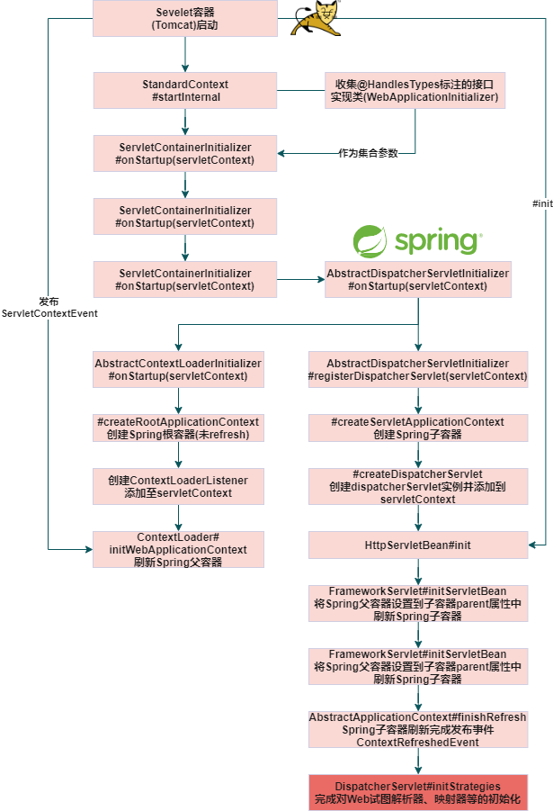

## Spring源码解析：SpringMVC启动流程

#### I. Spring父子容器

- [SpringMVC官方法文档](https://docs.spring.io/spring-framework/docs/5.3.10/reference/html/web.html#spring-web)

Spring官方将Spring容器划分为两个层级，一层包含Controller、视图以及其他的web相关组件的bean容器，主要接收Web请求；另一层包含处理业务逻辑、数据库访问逻辑的组件的bean容器，称为root容器。


#### II. 传统SpringWeb工程

Servlet3.0以前的Spring Web工程需要通过web.xml配置两大组件：

- ContextLoaderListenerSpring源码解析：SpringMVC启动流程.md
- DispatcherServlet

```xml

<web-app>

    <listener>
        <listener-class>org.springframework.web.context.ContextLoaderListener</listener-class>
    </listener>

    <context-param>
        <param-name>contextConfigLocation</param-name>
        <param-value>/WEB-INF/app-context.xml</param-value>
    </context-param>

    <servlet>
        <servlet-name>app</servlet-name>
        <servlet-class>org.springframework.web.servlet.DispatcherServlet</servlet-class>
        <init-param>
            <param-name>contextConfigLocation</param-name>
            <param-value></param-value>
        </init-param>
        <load-on-startup>1</load-on-startup>
    </servlet>

    <servlet-mapping>
        <servlet-name>app</servlet-name>
        <url-pattern>/app/*</url-pattern>
    </servlet-mapping>

</web-app>
```

根据Spring官方对父子容器的介绍，我们推测这里`ContextLoaderListener`、`DispatcherServlet`分别于父子容器的初始化相关。带着这个假设分析SpringMVC启动源码。

#### III. 基于Servlet3.0+创建工程

基于maven archetype(=`maven-archetype.webapp`)创建web工程。工程代码参考[in-depth-spring-webapp](https://github.com/turn-left/in-depth-spring-source/tree/master/in-depth-spring-webapp)

- 在pom文件中添加SpringMVC基础依赖

```xml

<dependency>
    <groupId>junit</groupId>
    <artifactId>junit</artifactId>
    <version>4.13.2</version>
    <scope>test</scope>
</dependency>

<dependency>
<groupId>org.springframework</groupId>
<artifactId>spring-webmvc</artifactId>
<version>5.2.12</version>
</dependency>

<dependency>
<groupId>javax.servlet</groupId>
<artifactId>javax.servlet-api</artifactId>
<version>4.0.1</version>
</dependency>
```

创建父子容器 `RootAppConfig` 、`WebAppConfig`以及`WebApplicationInitializer`实现类。
- Spring父容器`RootAppConfig`
```java
package com.ethen.webapp.config;

// import ...

/**
 * Spring根容器
 * <p>
 * 扫描排除controller层
 *
 * @author ethenyang@126.com
 * @since 2022/03/16
 */
@Configuration
@ComponentScan(basePackages = {"com.ethen.webapp"}, excludeFilters = {
        @ComponentScan.Filter(type = FilterType.ANNOTATION, value = {RestController.class, Controller.class}),
        @ComponentScan.Filter(type = FilterType.ASSIGNABLE_TYPE, value = {WebAppConfig.class})
})
public class RootAppConfig {
}
```

- Spring子容器`WebAppConfig`
```java
package com.ethen.webapp.config;

// import ...

/**
 * SpringMVC配置，Spring子容器
 * <p>
 * 仅扫描控制层
 *
 * @author ethenyang@126.com
 * @since 2022/03/16
 */
@ComponentScan(basePackages = "com.ethen.webapp", includeFilters = {
        @ComponentScan.Filter(type = FilterType.ANNOTATION, value = {RestController.class, Controller.class})}
)
@EnableWebMvc
@Configuration
public class WebAppConfig implements WebMvcConfigurer {

    @Bean
    public InternalResourceViewResolver jspViewResolver() {
        InternalResourceViewResolver viewResolver = new InternalResourceViewResolver();
        viewResolver.setPrefix("/WEB-INF/views/");
        viewResolver.setSuffix(".jsp");
        return viewResolver;
    }
}
```
- web服务入口类`MyWebAppInitializer`
这里我们继承了`AbstractAnnotationConfigDispatcherServletInitializer`抽象类，作为`WebApplicationInitializer`实现。

```java
package com.ethen.webapp.config;

// import ...

/**
 * Servlet3.0 SPI机制 fixme 容器启动初始化Spring容器
 *
 * @author ethenyang@126.com
 * @see org.springframework.web.SpringServletContainerInitializer
 * fixme Servlet容器启动时会收集类路径下{@link javax.servlet.annotation.HandlesTypes}中标注的接口，
 * Spring中是{@link WebApplicationInitializer}接口
 * @since 2022/03/16
 */
public class MyWebAppInitializer extends AbstractAnnotationConfigDispatcherServletInitializer {
    /**
     * Specify {@code @Configuration} and/or {@code @Component} classes for the
     * {@linkplain #createRootApplicationContext() root application context}.
     *
     * @return the configuration for the root application context, or {@code null}
     * if creation and registration of a root context is not desired
     */
    @Override
    protected Class<?>[] getRootConfigClasses() {
        return new Class[]{RootAppConfig.class};
    }

    /**
     * Specify {@code @Configuration} and/or {@code @Component} classes for the
     * {@linkplain #createServletApplicationContext() Servlet application context}.
     *
     * @return the configuration for the Servlet application context, or
     * {@code null} if all configuration is specified through root config classes.
     */
    @Override
    protected Class<?>[] getServletConfigClasses() {
        return new Class[]{WebAppConfig.class};
    }

    /**
     * Specify the servlet mapping(s) for the {@code DispatcherServlet} &mdash;
     * for example {@code "/"}, {@code "/app"}, etc.
     *
     * @see #registerDispatcherServlet(ServletContext)
     */
    @Override
    protected String[] getServletMappings() {
        return new String[]{"/"};
    }
}
```

#### IV. MVC容器启动流程

