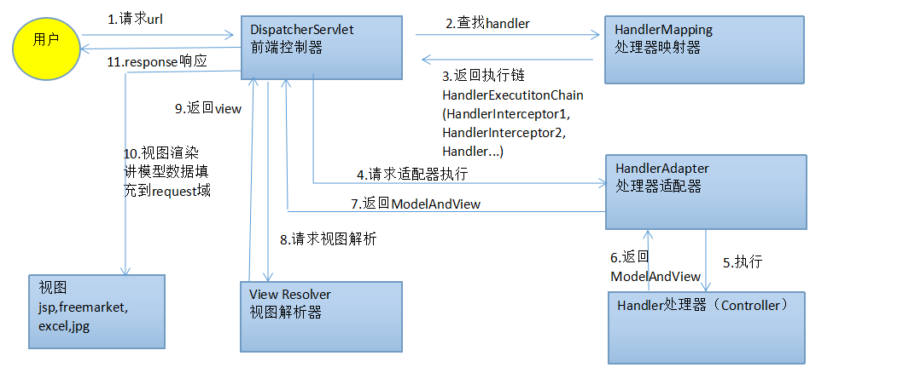

## Spring源码解析：SpringMVC启动流程

#### I. Spring父子容器

- [SpringMVC官方法文档](https://docs.spring.io/spring-framework/docs/5.3.10/reference/html/web.html#spring-web)

Spring官方将Spring容器划分为两个层级，一层包含Controller、视图以及其他的web相关组件的bean容器，主要接收Web请求；另一层包含处理业务逻辑、数据库访问逻辑的组件的bean容器，称为root容器。


#### II. 传统SpringWeb工程

Servlet3.0以前的Spring Web工程需要通过web.xml配置两大组件：

- ContextLoaderListenerSpring源码解析：SpringMVC启动流程.md
- DispatcherServlet

```xml

<web-app>

    <listener>
        <listener-class>org.springframework.web.context.ContextLoaderListener</listener-class>
    </listener>

    <context-param>
        <param-name>contextConfigLocation</param-name>
        <param-value>/WEB-INF/app-context.xml</param-value>
    </context-param>

    <servlet>
        <servlet-name>app</servlet-name>
        <servlet-class>org.springframework.web.servlet.DispatcherServlet</servlet-class>
        <init-param>
            <param-name>contextConfigLocation</param-name>
            <param-value></param-value>
        </init-param>
        <load-on-startup>1</load-on-startup>
    </servlet>

    <servlet-mapping>
        <servlet-name>app</servlet-name>
        <url-pattern>/app/*</url-pattern>
    </servlet-mapping>

</web-app>
```

根据Spring官方对父子容器的介绍，我们推测这里`ContextLoaderListener`、`DispatcherServlet`分别于父子容器的初始化相关。带着这个假设分析SpringMVC启动源码。

#### III. 基于Servlet3.0+创建工程

基于maven archetype(=`maven-archetype.webapp`)
创建web工程。工程代码参考[in-depth-spring-webapp](https://github.com/turn-left/in-depth-spring-source/tree/master/in-depth-spring-webapp)
。

- 在pom文件中添加SpringMVC基础依赖

```xml

<dependency>
    <groupId>junit</groupId>
    <artifactId>junit</artifactId>
    <version>4.13.2</version>
    <scope>test</scope>
</dependency>

<dependency>
<groupId>org.springframework</groupId>
<artifactId>spring-webmvc</artifactId>
<version>5.2.12</version>
</dependency>

<dependency>
<groupId>javax.servlet</groupId>
<artifactId>javax.servlet-api</artifactId>
<version>4.0.1</version>
</dependency>
```

创建父子容器 `RootAppConfig` 、`WebAppConfig`以及`WebApplicationInitializer`实现类。

- Spring父容器`RootAppConfig`

```java
package com.ethen.webapp.config;

// import ...

/**
 * Spring根容器
 * <p>
 * 扫描排除controller层
 *
 * @author ethenyang@126.com
 * @since 2022/03/16
 */
@Configuration
@ComponentScan(basePackages = {"com.ethen.webapp"}, excludeFilters = {
        @ComponentScan.Filter(type = FilterType.ANNOTATION, value = {RestController.class, Controller.class}),
        @ComponentScan.Filter(type = FilterType.ASSIGNABLE_TYPE, value = {WebAppConfig.class})
})
public class RootAppConfig {
}
```

- Spring子容器`WebAppConfig`

```java
package com.ethen.webapp.config;

// import ...

/**
 * SpringMVC配置，Spring子容器
 * <p>
 * 仅扫描控制层
 *
 * @author ethenyang@126.com
 * @since 2022/03/16
 */
@ComponentScan(basePackages = "com.ethen.webapp", includeFilters = {
        @ComponentScan.Filter(type = FilterType.ANNOTATION, value = {RestController.class, Controller.class})}
)
@EnableWebMvc
@Configuration
public class WebAppConfig implements WebMvcConfigurer {

    @Bean
    public InternalResourceViewResolver jspViewResolver() {
        InternalResourceViewResolver viewResolver = new InternalResourceViewResolver();
        viewResolver.setPrefix("/WEB-INF/views/");
        viewResolver.setSuffix(".jsp");
        return viewResolver;
    }
}
```

- web服务入口类`MyWebAppInitializer`
  这里我们继承了`AbstractAnnotationConfigDispatcherServletInitializer`抽象类，作为`WebApplicationInitializer`实现。

```java
package com.ethen.webapp.config;

// import ...

/**
 * Servlet3.0 SPI机制 fixme 容器启动初始化Spring容器
 *
 * @author ethenyang@126.com
 * @see org.springframework.web.SpringServletContainerInitializer
 * fixme Servlet容器启动时会收集类路径下{@link javax.servlet.annotation.HandlesTypes}中标注的接口，
 * Spring中是{@link WebApplicationInitializer}接口
 * @since 2022/03/16
 */
public class MyWebAppInitializer extends AbstractAnnotationConfigDispatcherServletInitializer {
    /**
     * Specify {@code @Configuration} and/or {@code @Component} classes for the
     * {@linkplain #createRootApplicationContext() root application context}.
     *
     * @return the configuration for the root application context, or {@code null}
     * if creation and registration of a root context is not desired
     */
    @Override
    protected Class<?>[] getRootConfigClasses() {
        return new Class[]{RootAppConfig.class};
    }

    /**
     * Specify {@code @Configuration} and/or {@code @Component} classes for the
     * {@linkplain #createServletApplicationContext() Servlet application context}.
     *
     * @return the configuration for the Servlet application context, or
     * {@code null} if all configuration is specified through root config classes.
     */
    @Override
    protected Class<?>[] getServletConfigClasses() {
        return new Class[]{WebAppConfig.class};
    }

    /**
     * Specify the servlet mapping(s) for the {@code DispatcherServlet} &mdash;
     * for example {@code "/"}, {@code "/app"}, etc.
     *
     * @see #registerDispatcherServlet(ServletContext)
     */
    @Override
    protected String[] getServletMappings() {
        return new String[]{"/"};
    }
}
```

#### IV. MVC容器启动流程


#### V. MVC九大组件

Spring MVC是Spring提供的一个基于MVC设计模式的轻量级 Web 开发框架，本质上相当于 `Servlet`。MVC九大组件在`DispatcherServlet`的**init()**方法中初始化。

| 组件                        | 用途                                                         |                                                              |
| :-------------------------- | :----------------------------------------------------------- | ------------------------------------------------------------ |
| MultipartResolver           | 用于处理多文件上传请求。                                     | MultipartResolver是一个大家很熟悉的组件，用于处理上传请求，通过将普通的请求包装成MultipartHttpServletRequest来实现。MultipartHttpServletRequest可以通过getFile()方法直接获得文件。如果上传多个文件，还可以调用getFileMap()方法得到 Map< FileName, File> 这样的结构。MultipartResolver的作用就是封装普通的请求，使其拥有文件上传的功能。 |
| LocaleResolver              | 用于从请求中解析出 Locale，是i18n的基础。                    | ViewResolver组件的resolveViewName()方法需要两个参数，一个是视图名，另一个就是Locale。参数Locale是从哪来的呢？这就是LocaleResolver组件要做的事。LocaleResolver用于从请求中解析出 Locale，比如在中国Locale当然就是zh-CN，用来表示一个区域。这个组件也是i18n的基础。 |
| ThemeResolver               | 用来解析样式、图片及它们所形成的显示效果的集合。             | 从名字便可看出，ThemeResolver组件是用来解析主题的。主题就是样式、图片及它们所形成的显示效果的集合。Spring MVC中一套主题对应一个properties文件，里面存放着与当前主题相关的所有资源，如图片、CSS样式等。创建主题非常简单，只需准备好资源，然后新建一个“主题名.properties”并将资源设置进去，放在classpath下，之后便可以在页面中使用了。Spring MVC中与主题有关的类有ThemeResolver、ThemeSource和Theme。ThemeResolver负责从请求中解析出主题名，ThemeSource则根据主题名找到具体的主题，其抽象也就是Theme，可以通过Theme来获取主题和具体的资源。 |
| HandlerMapping              | 保存Url和逻辑处理的映射关系，                                | HandlerMapping是用来查找Handler的，也就是处理器，具体的表现形式可以是类，也可以是方法。比如，标注了@RequestMapping的每个方法都可以看成一个Handler。Handler负责实际的请求处理，在请求到达后，HandlerMapping的作用便是找到请求相应的处理器Handler和Interceptor。 |
| HandlerAdapter              | 动态参数适配器，让固定的Servlet处理方法调用Handler来进行处理 | 从名字上看，HandlerAdapter是一个适配器。因为Spring MVC中Handler可以是任意形式的，只要能够处理请求便可。但是把请求交给Servlet的时候，由于Servlet的方法结构都是doService(HttpServletRequest req, HttpServletResponse resp)形式的，要让固定的Servlet处理方法调用Handler来进行处理，这一步工作便是HandlerAdapter要做的事。 |
| HandlerExceptionResolver    | 用来处理Handler产生的异常情况的组件。                        | 从组件的名字上看，HandlerExceptionResolver是用来处理Handler产生的异常情况的组件。具体来说，此组件的作用是根据异常设置ModelAndView，之后交给渲染方法进行渲染，渲染方法会将ModelAndView渲染成页面。不过要注意，HandlerExceptionResolver只用于解析对请求做处理阶段产生的异常，渲染阶段的异常不归它管，这也是Spring MVC 组件设计的一大原则—分工明确、互不干涉。 |
| RequestToViewNameTranslator | 从请求中获取ViewName                                         | RequestToViewNameTranslator组件的作用是从请求中获取ViewName。因为ViewResolver根据ViewName查找View，但有的Handler处理完成之后，没有设置View，也没有设置ViewName，便要通过这个组件来从请求中查找ViewName。 |
| ViewResolvers               | 主要作用是将String类型的视图名和Locale解析为View类型的视图   | ViewResolver即视图解析器，相信大家对这个组件应该很熟悉了。通常在Spring MVC的配置文件中，都会配上一个实现类来进行视图解析。这个组件的主要作用是将String类型的视图名和Locale解析为View类型的视图，只有一个resolveViewName()方法。从方法的定义可以看出，Controller层返回的String类型的视图名viewName最终会在这里被解析成为View。View是用来渲染页面的，也就是说，它会将程序返回的参数和数据填入模板中，生成HTML文件。ViewResolver在这个过程中主要做两件大事：ViewResolver会找到渲染所用的模板（第一件大事）和所用的技术（第二件大事，其实也就是找到视图的类型，如JSP）并填入参数。默认情况下，Spring MVC会为我们自动配置一个InternalResourceViewResolver，是针对JSP类型视图的。 |
| FlashMapManager             | 用于重定向时的参数传递。                                     | 说到FlashMapManager组件，得先说一下FlashMap。FlashMap用于重定向时的参数传递，比如在处理用户订单时，为了避免重复提交，可以处理完post请求后重定向到一个get请求，这个get请求可以用来显示订单详情之类的信息。这样做虽然可以规避用户重新提交订单的问题，但是在这个页面上要显示订单的信息，这些数据从哪里获取呢？因为重定向是没有传递参数这一功能的，如果不想把参数写进URL（其实也不推荐这么做，除了URL有长度限制，把参数都直接暴露也不安全），那么就可以通过FlashMap来传递。只需要在重定向之前将要传递的数据写入请求（可以通过ServletRequestAttributes.getRequest()方法获得）的属性OUTPUT_FLASH_MAP_ATTRIBUTE中，这样在重定向之后的Handler中Spring就会自动将其设置到Model中，在显示订单信息的页面上就可以直接从Model中获得数据。FlashMapManager就是用来管理FlashMap的。 |

#### VI. SpringMVC关键组件执行流程



#### 参考资料

- [SpringMVC执行流程及工作原理](https://www.jianshu.com/p/8a20c547e245)

- [Spring核心原理分析之MVC九大组件](https://cloud.tencent.com/developer/article/1925541)
