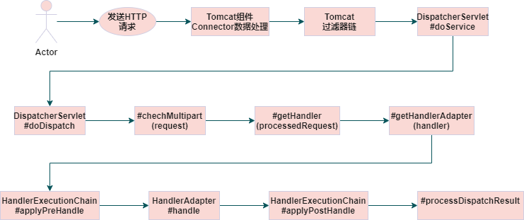
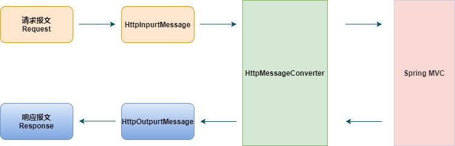

## Spring源码：SpringMVC请求流程分析

#### 简要整体流程

1.客户端发起Http请求到服务器，tomcat组件接收请求。

2.请求经过tomcat过滤器链处理。

3.请求被DispatcherServlet接收。

4.判断是否为Multipart请求，是则对request加以转换。

5.在HandlerMapping列表中查找handler,并结合拦截器(HandlerInterceptor)，组装成HandlerExecutionChain实例，为request的处理链，及mappedHandler对象。

6.从handlerAdapters列表中获取具体的HandlerAdapter。

7.调用拦截器preHandle方法。

8.调用HandlerAdapter的handle方法。

9.调用拦截器的postHandle的方法。

...

#### HttpMessageConverter消息转换逻辑

#### HandlerInterceptor拦截器执行原理

#### @ControllerAdvice全局异常处理原理

RequestMappingHandlerAdapter -> afterPropertiesSet() -> initControllerAdviceCache()

#### 遗留问题：

controller有return跟void区别？return和response流写出的区别？

Spring统一异常处理的方式及原理总结？

SpringMVC返回json是用什么视图解析器？@ResponseBody与MessageConvert

spring文件上传问题？

#### 参考文章

- [如何优雅的读写HttpServletRequest和HttpServletResponse的请求体](https://www.cnblogs.com/felordcn/p/15753963.html)
- [HttpMessageConverter数据转换原理](https://cloud.tencent.com/developer/article/1498522)